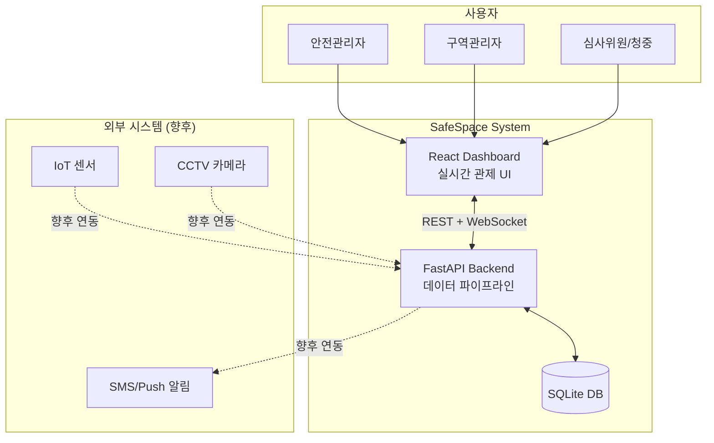
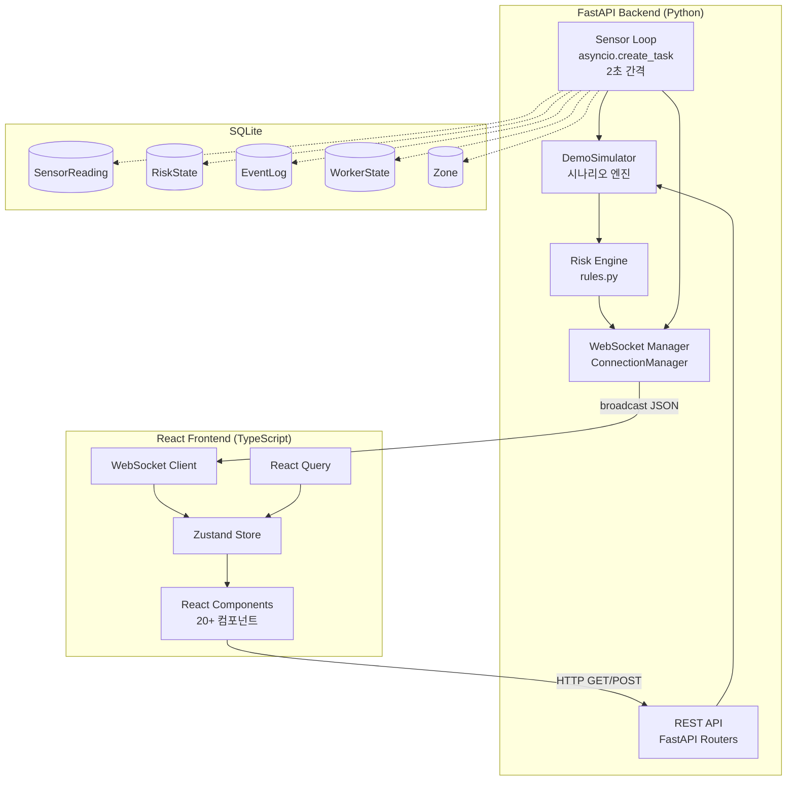
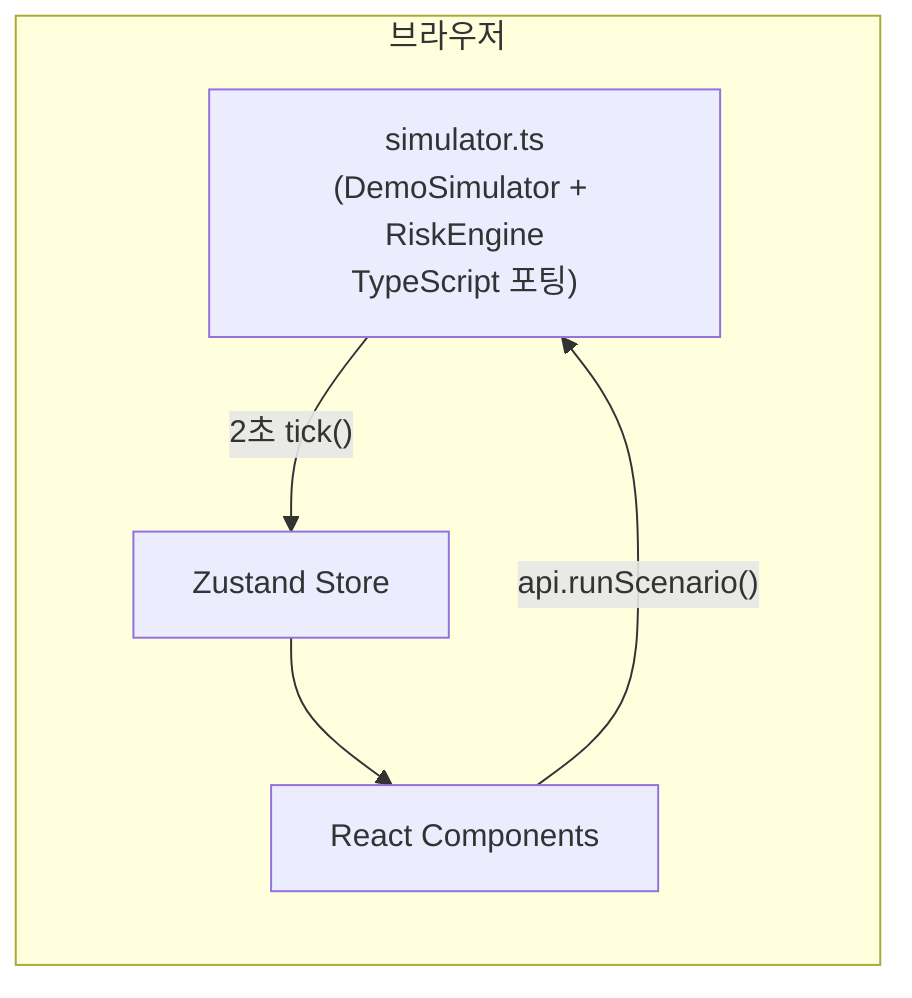
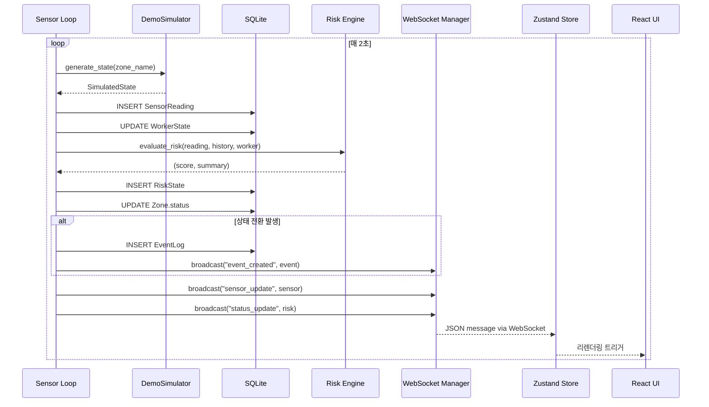
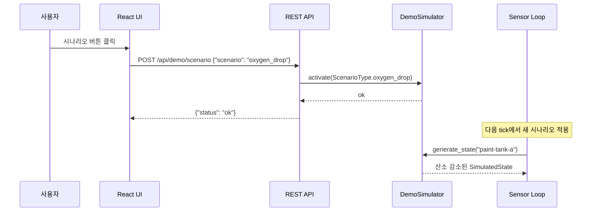
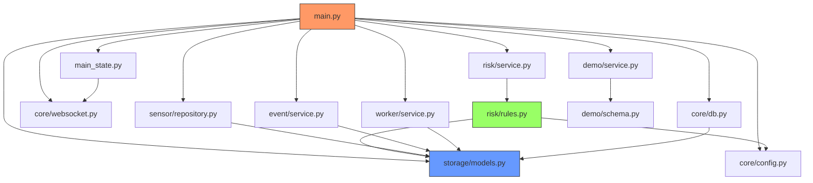
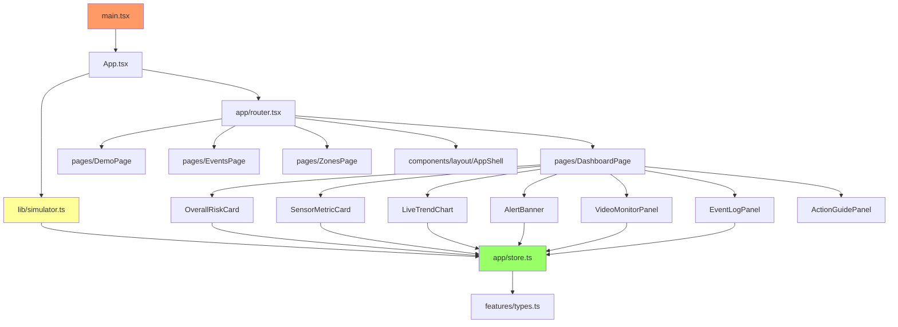
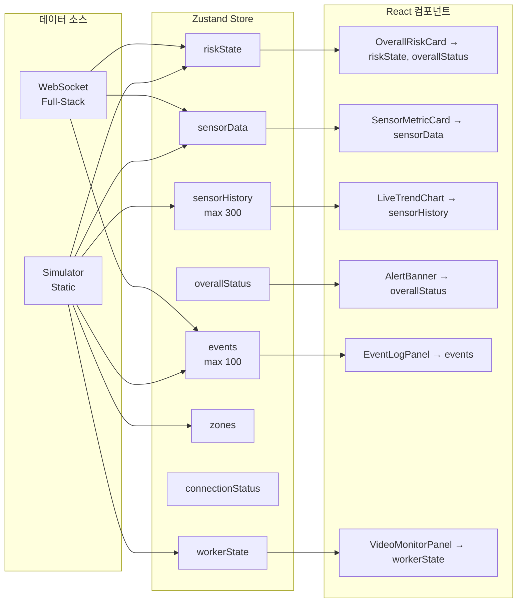
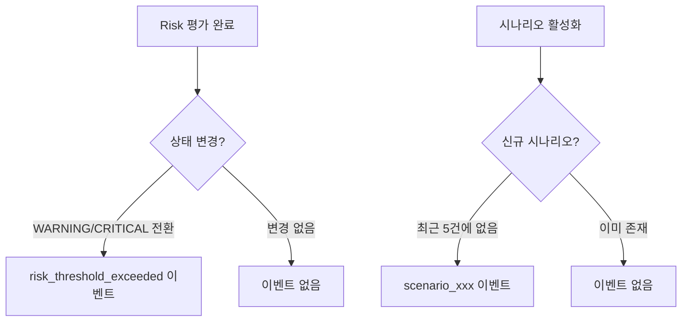

# 아키텍처

SafeSpace의 시스템 아키텍처, 데이터 흐름, 모듈 의존성을 설명한다.

---

## 시스템 개요

SafeSpace는 두 가지 실행 모드를 지원한다:

1. **Full-Stack 모드**: FastAPI 백엔드가 센서 데이터를 생성하고 WebSocket으로 프론트엔드에 전달
2. **Static 모드**: 클라이언트 사이드 시뮬레이터가 브라우저에서 직접 데이터 생성 (GitHub Pages)

---

## 시스템 컨텍스트

---

## Full-Stack 모드 아키텍처

---

## Static 모드 아키텍처

!!! info "두 모드의 코드 공유"
    프론트엔드 컴포넌트는 `api` 객체를 통해 데이터에 접근한다. Full-Stack 모드에서는 `lib/api.ts`의 HTTP 클라이언트를, Static 모드에서는 `lib/simulator.ts`의 인메모리 API를 사용한다. 인터페이스가 동일하므로 컴포넌트 코드 변경이 불필요하다.

---

## 데이터 흐름

### 센서 데이터 생성 → UI 표시

### 시나리오 활성화 흐름

---

## 모듈 의존성

### 백엔드 모듈 관계

### 프론트엔드 모듈 관계

---

## 상태 관리 아키텍처

---

## 이벤트 구동 아키텍처

시스템은 이벤트 구동(event-driven) 패턴을 따른다.

| 이벤트 | 발생 시점 | 소비자 |
|--------|-----------|--------|
| `sensor_update` | 매 2초, 구역별 | 센서 카드, 차트, 히스토리 |
| `status_update` | 매 2초, 구역별 | 리스크 게이지, 배너, 상태 뱃지 |
| `event_created` | 상태 전환 시 | 이벤트 로그, 조치 가이드 |

### 이벤트 생성 조건

---

## 확장 포인트

| 확장 영역 | 현재 | 확장 방법 |
|-----------|------|-----------|
| 데이터 소스 | DemoSimulator | MQTT 브릿지 → 실제 IoT 센서 |
| 영상 분석 | 시뮬레이션 | MediaPipe Pose → WorkerState API |
| 데이터베이스 | SQLite | PostgreSQL + 커넥션 풀 |
| 알림 | UI 배너만 | WebHook → SMS/Email/Push |
| 인증 | 없음 | FastAPI OAuth2 + JWT |
| 캐싱 | 없음 | Redis (센서 최신값, 세션) |
