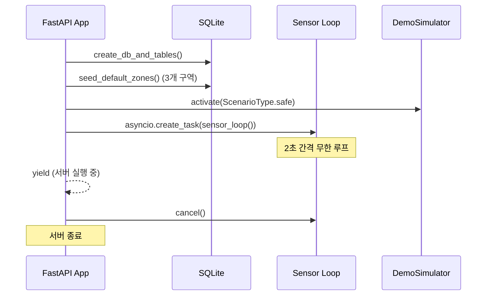
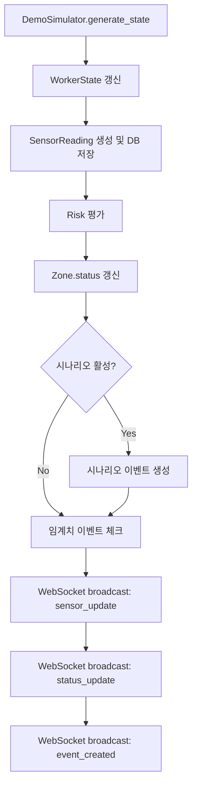

# 백엔드 구조

FastAPI 기반의 실시간 데이터 파이프라인이다. 센서 데이터 생성, 위험 평가, 이벤트 관리, WebSocket 브로드캐스트를 담당한다.

---

## 디렉터리 구조

```
backend/app/
├── main.py              # FastAPI 앱, lifespan, sensor_loop, dashboard API, WebSocket
├── main_state.py        # RuntimeState 싱글턴 (sensor_task, websocket_manager, demo_simulator)
│
├── core/                # 인프라
│   ├── config.py        # Settings 데이터클래스 (임계치, 경로 설정)
│   ├── db.py            # SQLite + SQLModel 엔진, 세션 팩토리
│   └── websocket.py     # ConnectionManager (브로드캐스트)
│
├── sensor/              # 센서 도메인
│   ├── api.py           # GET /api/sensors/latest, /api/sensors/history
│   ├── service.py       # 센서 데이터 조회 로직
│   ├── schema.py        # Pydantic 요청/응답 스키마
│   └── repository.py    # SensorReading CRUD
│
├── risk/                # 위험 평가 도메인
│   ├── service.py       # evaluate_risk 오케스트레이터
│   └── rules.py         # 점수 산정 함수 (oxygen_risk, gas_risk 등)
│
├── event/               # 이벤트 도메인
│   ├── api.py           # GET /api/events
│   ├── service.py       # 이벤트 생성/조회
│   ├── schema.py        # EventCreate 스키마
│   └── repository.py    # EventLog CRUD
│
├── zone/                # 구역 도메인
│   ├── api.py           # GET /api/zones
│   ├── service.py       # 구역 조회
│   └── schema.py        # Zone 응답 스키마
│
├── worker/              # 작업자 도메인
│   ├── api.py           # GET /api/worker/status
│   ├── service.py       # 작업자 상태 갱신/조회
│   └── schema.py        # WorkerState 응답 스키마
│
├── demo/                # 데모 시뮬레이션
│   ├── api.py           # POST /api/demo/scenario
│   ├── service.py       # DemoSimulator 클래스
│   └── schema.py        # ScenarioType enum
│
└── storage/
    └── models.py        # 5개 SQLModel 테이블 정의
```

---

## 애플리케이션 생명주기

FastAPI의 `lifespan` 컨텍스트 매니저로 시작/종료를 관리한다.



### 기본 구역 시드 데이터

| name | type | location_label |
|------|------|----------------|
| `paint-tank-a` | `paint_tank` | Dock 1 / Paint Tank A |
| `cargo-hold-b` | `cargo_hold` | Dock 2 / Cargo Hold B |
| `engine-room-c` | `engine_room` | Vessel 7 / Engine Room C |

---

## 센서 루프

`sensor_loop()`는 백엔드의 핵심 루프이다. 2초(`settings.sensor_interval_seconds`) 간격으로 모든 구역을 순회하며 데이터를 생성한다.

### 루프 동작 (구역당)



### 에러 처리

센서 루프는 `try/except`로 감싸져 있어 개별 루프 실패 시에도 다음 주기에 정상 동작한다.

```python
async def sensor_loop() -> None:
    while True:
        try:
            # ... 구역별 처리 ...
        except Exception as exc:
            print(f"Sensor loop error: {exc}")
        await asyncio.sleep(settings.sensor_interval_seconds)
```

---

## DemoSimulator

시나리오 기반 센서 데이터 생성기이다. `asyncio.Lock`으로 동시성을 보장한다.

### 시나리오 적용 규칙

!!! warning "중요"
    시나리오는 **`paint-tank-a` 구역에만** 적용된다. 다른 구역은 항상 safe 베이스라인을 생성한다.

### 구역별 환경 오프셋

| 구역 | 온도 오프셋 | 습도 오프셋 | 설명 |
|------|------------|------------|------|
| paint-tank-a | +1.8°C | +4.0% | 도장 작업 열기 |
| cargo-hold-b | -1.4°C | +7.0% | 선창 습기 |
| engine-room-c | +5.5°C | -6.0% | 기관실 고온 |

### Safe 베이스라인 값

| 센서 | 기본값 | 랜덤 범위 |
|------|--------|-----------|
| O₂ | 20.8% | ±0.12~0.06 |
| H₂S | 1.0 ppm | ±0.2~0.3 |
| CO | 5.0 ppm | ±1.2~1.4 |
| VOC | 80.0 ppm | ±8~10 |
| 온도 | 24°C + 구역 오프셋 | ±0.8~1.0 |
| 습도 | 58% + 구역 오프셋 | ±3.0 |

---

## 설정 (Settings)

`core/config.py`의 `Settings` 데이터클래스로 모든 설정을 관리한다.

```python
@dataclass(slots=True)
class Settings:
    db_path: str = "./safespace.db"
    websocket_path: str = "/ws/live"
    websocket_ping_interval_seconds: int = 20
    sensor_interval_seconds: int = 2

    # 센서 임계치
    oxygen_safe_min: float = 19.5
    oxygen_warning_min: float = 18.0
    h2s_safe_max: float = 5.0
    h2s_warning_max: float = 10.0
    co_safe_max: float = 25.0
    co_warning_max: float = 50.0
    voc_safe_max: float = 100.0
    voc_warning_max: float = 200.0
```

---

## WebSocket 관리

`core/websocket.py`의 `ConnectionManager`가 모든 WebSocket 연결을 관리한다.

| 메서드 | 동작 |
|--------|------|
| `connect(ws)` | 연결 수락 후 `active_connections` 목록에 추가 |
| `disconnect(ws)` | 목록에서 제거 |
| `broadcast(type, data)` | 모든 연결에 `{"type": ..., "data": ...}` 전송. 실패한 연결은 자동 정리 |

### 메시지 형식

```json
{
  "type": "sensor_update",
  "data": {
    "zone_id": "paint-tank-a",
    "oxygen": 19.2,
    "h2s": 11.4,
    ...
  }
}
```

---

## RuntimeState 싱글턴

`main_state.py`에 정의된 런타임 상태 컨테이너이다.

| 필드 | 타입 | 용도 |
|------|------|------|
| `sensor_task` | `asyncio.Task \| None` | 센서 루프 태스크 참조 |
| `websocket_manager` | `ConnectionManager` | WebSocket 브로드캐스터 |
| `demo_simulator` | `DemoSimulator \| None` | 시나리오 시뮬레이터 참조 |

---

## CORS 설정

개발 및 데모 편의를 위해 모든 출처를 허용한다.

```python
app.add_middleware(
    CORSMiddleware,
    allow_origins=["*"],
    allow_credentials=True,
    allow_methods=["*"],
    allow_headers=["*"],
)
```

!!! warning "프로덕션 주의"
    프로덕션 환경에서는 `allow_origins`를 실제 도메인으로 제한해야 한다.

---

## 라우터 등록

```python
app.include_router(sensor_router)   # /api/sensors/*
app.include_router(event_router)    # /api/events
app.include_router(zone_router)     # /api/zones
app.include_router(worker_router)   # /api/worker/*
app.include_router(demo_router)     # /api/demo/*
```

대시보드 요약 API (`GET /api/dashboard/summary`)와 WebSocket (`/ws/live`)은 `main.py`에 직접 정의되어 있다.
