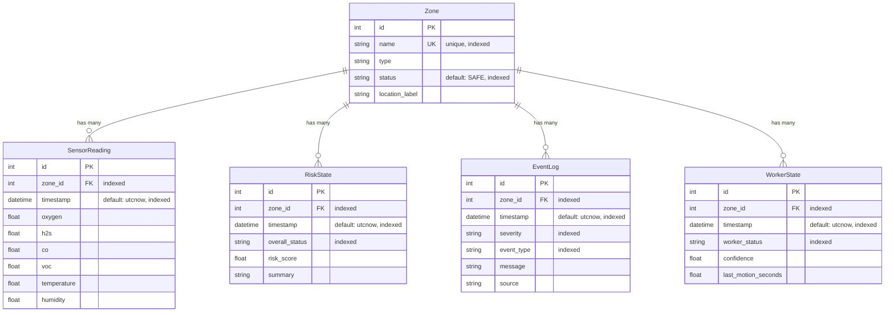

# 데이터 모델

SQLModel 기반 ORM으로 SQLite에 저장한다. 5개의 테이블이 구역(Zone)을 중심으로 관계를 형성한다.

---

## ER 다이어그램

---

## 테이블 상세

### Zone

구역 마스터 테이블이다. 다른 모든 테이블이 `zone_id`로 참조한다.

| 필드 | 타입 | 제약조건 | 설명 |
|------|------|----------|------|
| `id` | `int` | PK, 자동 증가 | 내부 식별자 |
| `name` | `string` | UNIQUE, INDEX | 구역 식별자 (`paint-tank-a` 등) |
| `type` | `string` | - | 구역 유형 (`paint_tank`, `cargo_hold`, `engine_room`) |
| `status` | `string` | INDEX, default=`SAFE` | 현재 위험 상태 |
| `location_label` | `string` | - | 표시용 위치 (`Dock 1 / Paint Tank A`) |

**기본 시드 데이터**

| name | type | status | location_label |
|------|------|--------|----------------|
| `paint-tank-a` | `paint_tank` | `SAFE` | Dock 1 / Paint Tank A |
| `cargo-hold-b` | `cargo_hold` | `SAFE` | Dock 2 / Cargo Hold B |
| `engine-room-c` | `engine_room` | `SAFE` | Vessel 7 / Engine Room C |

---

### SensorReading

센서 측정값 저장 테이블이다. 2초 간격으로 구역별 INSERT된다.

| 필드 | 타입 | 제약조건 | 단위 | 설명 |
|------|------|----------|------|------|
| `id` | `int` | PK | - | 자동 증가 |
| `zone_id` | `int` | FK→Zone.id, INDEX | - | 구역 참조 |
| `timestamp` | `datetime` | INDEX, default=`utcnow()` | - | 측정 시각 (UTC) |
| `oxygen` | `float` | - | % | 산소 농도 (정상: ~20.8%) |
| `h2s` | `float` | - | ppm | 황화수소 (정상: ~1.0) |
| `co` | `float` | - | ppm | 일산화탄소 (정상: ~5.0) |
| `voc` | `float` | - | ppm | 휘발성유기화합물 (정상: ~80.0) |
| `temperature` | `float` | - | °C | 온도 (정상: ~24.0+구역 오프셋) |
| `humidity` | `float` | - | % | 습도 (정상: ~58.0+구역 오프셋) |

!!! info "데이터 증가율"
    3개 구역 × 2초 간격 = 분당 90행, 시간당 5,400행. 장시간 운영 시 정기적 정리가 필요하다.

---

### RiskState

위험 평가 결과 저장 테이블이다. 매 센서 갱신마다 INSERT된다.

| 필드 | 타입 | 제약조건 | 설명 |
|------|------|----------|------|
| `id` | `int` | PK | 자동 증가 |
| `zone_id` | `int` | FK→Zone.id, INDEX | 구역 참조 |
| `timestamp` | `datetime` | INDEX, default=`utcnow()` | 평가 시각 |
| `overall_status` | `string` | INDEX | `SAFE` \| `CAUTION` \| `WARNING` \| `CRITICAL` |
| `risk_score` | `float` | - | 0~100 범위 복합 점수 |
| `summary` | `string` | - | 위험 요약 텍스트 |

---

### EventLog

시스템 이벤트 기록 테이블이다. 상태 변화나 시나리오 활성화 시 INSERT된다.

| 필드 | 타입 | 제약조건 | 설명 |
|------|------|----------|------|
| `id` | `int` | PK | 자동 증가 |
| `zone_id` | `int` | FK→Zone.id, INDEX | 구역 참조 |
| `timestamp` | `datetime` | INDEX, default=`utcnow()` | 이벤트 시각 |
| `severity` | `string` | INDEX | `info` \| `warning` \| `critical` |
| `event_type` | `string` | INDEX | 이벤트 유형 |
| `message` | `string` | - | 상세 메시지 |
| `source` | `string` | - | 발생 출처 |

**event_type 값**

| event_type | 발생 조건 | source |
|------------|-----------|--------|
| `risk_threshold_exceeded` | WARNING/CRITICAL 상태 전환 시 | `risk_engine` |
| `scenario_oxygen_drop` | oxygen_drop 시나리오 활성화 | `demo_simulator` |
| `scenario_gas_leak` | gas_leak 시나리오 활성화 | `demo_simulator` |
| `scenario_worker_collapse` | worker_collapse 시나리오 활성화 | `demo_simulator` |
| `scenario_multi_risk` | multi_risk 시나리오 활성화 | `demo_simulator` |

---

### WorkerState

작업자 상태 저장 테이블이다. 매 센서 루프에서 갱신된다.

| 필드 | 타입 | 제약조건 | 설명 |
|------|------|----------|------|
| `id` | `int` | PK | 자동 증가 |
| `zone_id` | `int` | FK→Zone.id, INDEX | 구역 참조 |
| `timestamp` | `datetime` | INDEX, default=`utcnow()` | 상태 기록 시각 |
| `worker_status` | `string` | INDEX | `normal` \| `inactive` \| `fall_suspected` \| `no_motion` |
| `confidence` | `float` | - | 감지 신뢰도 (0~1). 정상 시 0.98 |
| `last_motion_seconds` | `float` | - | 마지막 움직임 후 경과 시간 (초) |

---

## 인덱스 전략

모든 테이블의 `zone_id`와 `timestamp`에 인덱스가 설정되어 있다. 이는 다음 쿼리를 최적화한다:

| 쿼리 패턴 | 사용 인덱스 |
|-----------|------------|
| 특정 구역의 최신 센서 조회 | `zone_id` + `timestamp` |
| 특정 구역의 이벤트 필터링 | `zone_id` + `severity` |
| 기간 기반 센서 이력 조회 | `timestamp` |
| 상태별 이벤트 필터링 | `event_type` + `severity` |
| 위험 상태 이력 조회 | `zone_id` + `overall_status` |

---

## 프론트엔드 타입 매핑

백엔드 SQLModel 테이블과 프론트엔드 TypeScript 인터페이스의 매핑이다.

| 백엔드 (SQLModel) | 프론트엔드 (TypeScript) | 주요 차이 |
|-------------------|------------------------|-----------|
| `SensorReading` | `SensorData` | 프론트엔드에는 `zone_id` 미포함, `id` 미포함 |
| `RiskState` | `RiskState` | 동일 구조 |
| `EventLog` | `EventLog` | `zone_id`가 int→string으로 변환 |
| `WorkerState` | `WorkerState` | `zone_id` 미포함 |
| `Zone` | `Zone` | `id`가 int→string(name)으로 변환 |

!!! warning "zone_id 변환"
    백엔드에서는 `zone_id`가 정수형 FK이지만, API 응답과 프론트엔드에서는 문자열 구역명(`paint-tank-a`)으로 매핑된다. 이 변환은 `main.py`의 `process_zone()` 및 각 API 핸들러에서 수행한다.
