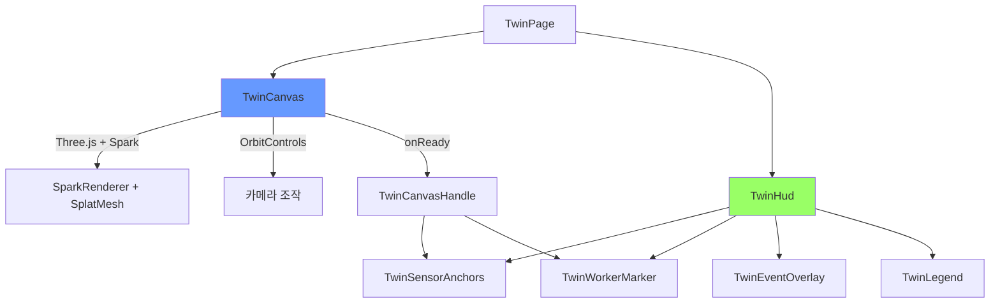

# 디지털 트윈

Spark 2.0 기반 3D 가우시안 스플래팅으로 밀폐공간을 시각화하고, 실시간 안전 데이터를 3D 공간 위에 오버레이하는 디지털 트윈 페이지이다.

---

## 개요

| 항목 | 설명 |
|------|------|
| 렌더링 | Three.js 0.180 + Spark 2.0 (`SparkRenderer`, `SplatMesh`) |
| 오버레이 | DOM/CSS 레이어 — `Vector3.project(camera)` 기반 |
| 라우트 | `/#/twin` (lazy loading, 별도 청크) |
| 데이터 소스 | `manifest.json`이 공간 의미 정보의 source of truth |

!!! info "R3F 미사용"
    첫 구현에서는 `@react-three/fiber` 없이 plain Three.js + SparkRenderer 래퍼 구조로 구현한다.

---

## 매니페스트 구조

각 구역의 3D 씬 정보는 `manifest.json`에 정의한다.

```typescript
interface TwinSceneManifest {
  version: 1
  zone: string                    // 구역 slug (예: 'paint-tank-a')
  title: string                   // 표시 이름
  splatUrl: string                // .spz 파일 경로
  thumbnailUrl?: string           // 미리보기 이미지
  defaultCamera: {
    position: [number, number, number]
    target: [number, number, number]
    fov?: number
  }
  anchors: {
    sensors: TwinSensorAnchor[]   // 센서 마커 위치
    worker: TwinWorkerAnchor      // 작업자 마커 위치
    exits: TwinExitAnchor[]       // 출구 위치
    hotspots?: TwinHotspot[]      // 이벤트/카메라/점검 포인트
    hazardVolumes?: TwinHazardVolume[]  // 위험 구역 볼륨
  }
}
```

### 앵커 타입

| 타입 | 필드 | 용도 |
|------|------|------|
| `TwinSensorAnchor` | `id`, `sensorKey`, `label`, `position` | 센서 데이터 오버레이 |
| `TwinWorkerAnchor` | `id`, `label`, `position` | 작업자 상태 오버레이 |
| `TwinExitAnchor` | `id`, `label`, `position` | 출구 위치 표시 |
| `TwinHotspot` | `id`, `type`, `label`, `position` | 이벤트/카메라/점검 포인트 |
| `TwinHazardVolume` | `id`, `label`, `center`, `size` | 위험 구역 박스 볼륨 |

---

## 정적 에셋 구조

```
frontend/public/twin/
├── index.json                  # { zones: ["paint-tank-a", "cargo-hold-b", "engine-room-c"] }
├── paint-tank-a/
│   ├── manifest.json           # TwinSceneManifest
│   └── scene.spz               # 3D 가우시안 스플랫 (1.1 MB)
├── cargo-hold-b/
│   ├── manifest.json
│   └── scene.spz               # 3D 가우시안 스플랫 (1.8 MB)
└── engine-room-c/
    ├── manifest.json
    └── scene.spz               # 3D 가우시안 스플랫 (2.5 MB)
```

`twin-loader.ts`가 구역별 `manifest.json`을 페치하여 Zustand 스토어(`twinManifestByZone`)에 캐싱한다. `index.json`은 향후 구역 동적 탐색을 위해 예비된 정적 에셋이다.

### 3D 에셋

`.spz` 파일은 저장소에 직접 포함되어 GitHub Pages에서 동일 오리진으로 서빙된다. 외부 CDN 의존성이 없어 CORS 문제 없이 안정적으로 로드된다.

| 구역 | 파일 | 원본 | 크기 |
|------|------|------|------|
| paint-tank-a | `scene.spz` | Spark JS `robot-head.spz` | 1.1 MB |
| cargo-hold-b | `scene.spz` | Spark JS `pedestal.spz` | 1.8 MB |
| engine-room-c | `scene.spz` | Spark JS `penguin.spz` | 2.5 MB |

`manifest.json`의 `splatUrl`에 상대 경로(`scene.spz`)를 지정하면 `twin-loader.ts`가 자동으로 절대 경로로 resolve한다. 절대 URL(`https://...`)도 지원한다.

!!! info "에셋 교체"
    실제 조선소 밀폐공간 3D 스캔 데이터가 준비되면, `scene.spz` 파일을 교체하거나 `manifest.json`의 `splatUrl`을 변경하면 된다. 컴포넌트 코드 수정은 불필요하다.

---

## 컴포넌트 아키텍처



### TwinCanvas

Three.js 씬을 관리하는 핵심 컴포넌트이다.

| 요소 | 설명 |
|------|------|
| `WebGLRenderer` | antialias off, alpha true, devicePixelRatio 제한 (max 2) |
| `SparkRenderer` | Spark 2.0 렌더러 — `scene.add(spark)` |
| `SplatMesh` | 가우시안 스플랫 메시 — `manifest.splatUrl`에서 로드 |
| `onProgress` | `.spz` 다운로드 진행률 추적 → 프로그래스 바 오버레이 표시 |
| `OrbitControls` | 마우스/터치 카메라 조작, damping 0.12 |
| `ResizeObserver` | 컨테이너 크기 변경 시 카메라/렌더러 리사이즈 |
| `TwinCanvasHandle` | `camera` + `canvasRect()` — HUD에 전달 |

### 로딩 UX

`.spz` 파일 다운로드 중 프로그래스 바를 표시한다.

1. `TwinPage`에서 `manifest.json` 로딩 시 `TwinLoadingState` 스피너 표시
2. `TwinCanvas`에서 `SplatMesh({ onProgress })` 콜백으로 다운로드 퍼센트 추적
3. 중앙 오버레이에 프로그래스 바 + 퍼센트 숫자 표시 (`bg-bg-deep/80 backdrop-blur`)
4. `onLoad` 콜백 시 오버레이 자동 제거, 3D 씬 노출

```typescript
splatMesh = new SplatMesh({
  url: manifestRef.current.splatUrl,
  onProgress: (e: ProgressEvent) => {
    if (e.lengthComputable && e.total > 0) {
      setSplatProgress(Math.round((e.loaded / e.total) * 100))
    }
  },
  onLoad: () => setSplatProgress(null),
})
```

### DOM 오버레이

HUD 컴포넌트는 React 컴포넌트이지만, 위치 업데이트는 `requestAnimationFrame` 루프에서 `ref`를 통해 직접 DOM 스타일을 수정한다. React 상태를 사용하지 않아 60fps 성능을 유지한다.

```typescript
// 매 프레임 실행
vec.set(...anchor.position)
vec.project(camera)
const x = (vec.x * 0.5 + 0.5) * rect.width
const y = (-vec.y * 0.5 + 0.5) * rect.height
el.style.transform = `translate(${x}px, ${y}px) translate(-50%, -100%)`
```

### HUD 구성 요소

| 컴포넌트 | 위치 | 데이터 소스 |
|----------|------|------------|
| `TwinSensorAnchors` | 3D 앵커 투영 좌표 | `useCurrentZoneSensor()` |
| `TwinWorkerMarker` | 3D 앵커 투영 좌표 | `useCurrentZoneWorker()` |
| `TwinEventOverlay` | 우측 하단 (fixed) | `useCurrentZoneEvents()` |
| `TwinLegend` | 우측 상단 (fixed) | 정적 범례 |

---

## 페이지 간 네비게이션

다른 페이지에서 Twin 페이지로 이동하는 "Open Twin" 버튼이 제공된다.

| 출발 페이지 | 위치 | 동작 |
|------------|------|------|
| Dashboard | `ZoneOverviewPanel` 각 구역 행 | `setCurrentZoneId(zone)` → `/twin` 이동 |
| Zones | 각 구역 카드 하단 | `setCurrentZoneId(zone)` → `/twin` 이동 |
| Events | 각 이벤트 행 우측 | `setCurrentZoneId(event.zone_id)` → `/twin` 이동 |

Dashboard의 `ZoneOverviewPanel`에서 구역 행 클릭 시 해당 구역이 `currentZoneId`로 설정된다.

---

## 성능 최적화

| 전략 | 설명 |
|------|------|
| 로컬 `.spz` 에셋 | 외부 CDN 의존 제거, 동일 오리진에서 서빙 (총 5.4 MB) |
| 프로그래스 바 | `SplatMesh.onProgress`로 다운로드 진행률 실시간 표시 |
| 라우트 레벨 lazy loading | `React.lazy(() => import('./TwinPage'))` — Three.js + Spark 별도 청크 (~5.5MB) |
| DOM 오버레이 | React 리렌더링 없이 `ref` + `rAF`로 위치 업데이트 |
| `will-change: transform` | 마커 엘리먼트에 GPU 레이어 힌트 |
| `devicePixelRatio` 제한 | `Math.min(window.devicePixelRatio, 2)` |
| `ResizeObserver` | 윈도우 이벤트 대신 컨테이너 관찰 |

---

## 확장 포인트

| 영역 | 현재 | 확장 방법 |
|------|------|-----------|
| 3D 데이터 | Spark JS 샘플 `.spz` (로컬 번들) | 실제 밀폐공간 3D 스캔 데이터로 교체 |
| 구역 추가 | 3개 구역 | `twin/index.json`에 구역 추가 + 매니페스트 생성 |
| 위험 볼륨 | 타입만 정의 | 반투명 박스 메시로 3D 시각화 |
| 경로 표시 | 미구현 | 출구 앵커 기반 대피 경로 라인 |
| 실시간 위치 | 고정 앵커 | RTLS 연동 시 작업자 위치 실시간 업데이트 |
