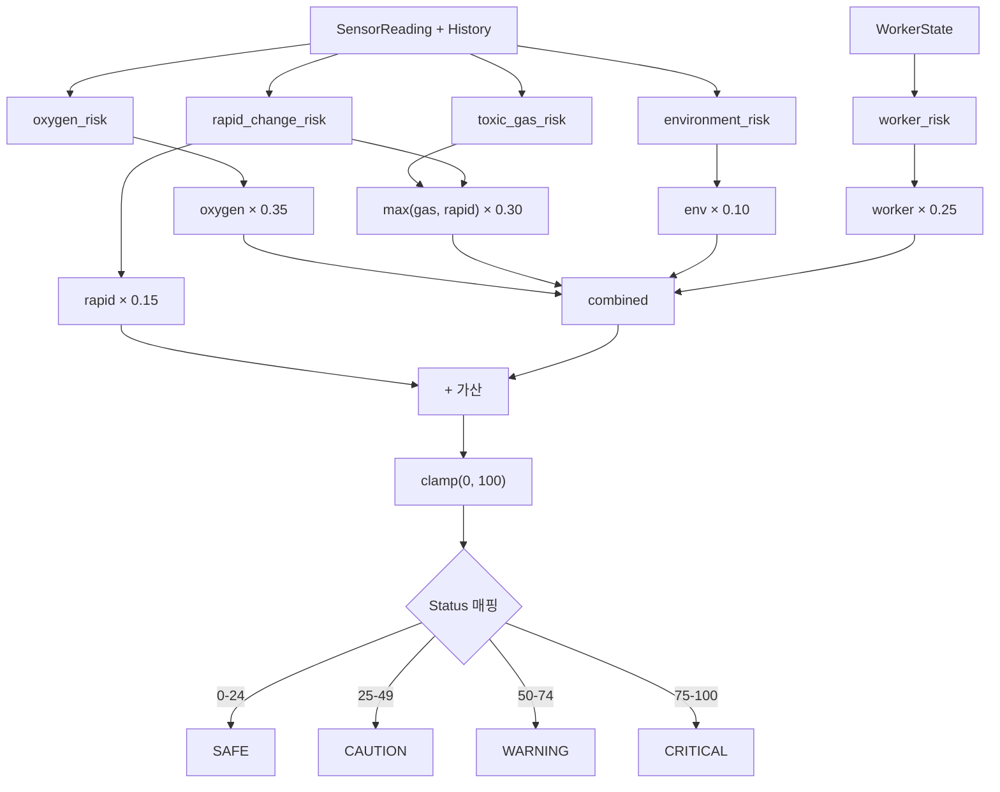

# 위험 판정 규칙

SafeSpace의 핵심인 위험 평가 엔진이다. `backend/app/risk/rules.py`에 구현되어 있으며, `frontend/src/lib/simulator.ts`에 동일 로직이 TypeScript로 포팅되어 있다.

---

## 위험 등급

| 레벨 | 점수 범위 | 색상 | 의미 |
|------|-----------|------|------|
| SAFE | 0 ~ 24 | Green | 모든 센서 안전 범위. 정상 작업 진행 |
| CAUTION | 25 ~ 49 | Yellow | 일부 수치 관찰 필요. 환기 상태 확인 |
| WARNING | 50 ~ 74 | Orange | 즉시 확인 필요. 작업 중단 준비 |
| CRITICAL | 75 ~ 100 | Red | 즉시 대피. 구조팀 투입 |

---

## 센서별 임계치

Settings 데이터클래스에서 설정된 값이다.

### 산소 (O₂)

| 범위 | 판정 | 점수 계산 |
|------|------|-----------|
| ≥ 19.5% | SAFE | 0점 |
| 18.0% ~ 19.5% | WARNING | 40 + (19.5-O₂)/(19.5-18.0) × 30 → **40~70점** |
| < 18.0% | CRITICAL | 75 + (18.0-O₂)/2.0 × 25 → **75~100점** |

### 유해가스 (H₂S, CO, VOC)

공통 산정 함수 `gas_risk(value, safe_max, warning_max)`를 사용한다.

| 센서 | SAFE 상한 | WARNING 상한 | 단위 |
|------|-----------|-------------|------|
| H₂S | 5.0 | 10.0 | ppm |
| CO | 25.0 | 50.0 | ppm |
| VOC | 100.0 | 200.0 | ppm |

| 범위 | 점수 계산 |
|------|-----------|
| ≤ safe_max | 0점 |
| safe_max ~ warning_max | 35 + (value-safe)/(warn-safe) × 30 → **35~65점** |
| > warning_max | 70 + (value-warn)/warn × 35 → **70~100+점** (clamp 100) |

최종 가스 위험도 = `max(H₂S 점수, CO 점수, VOC 점수)`

### 온습도 (환경)

| 조건 | 점수 계산 |
|------|-----------|
| 온도 < 15°C 또는 > 35°C | \|temperature - 25\| × 4 |
| 습도 < 25% 또는 > 80% | \|humidity - 55\| × 1.6 |
| 최종 | (온도 점수 + 습도 점수) / 2 |

---

## 급변 감지 (Rapid Change)

5분 이내 센서 이력의 평균값 대비 현재값의 변화량을 측정한다.

| 센서 | 급변 기준 | 점수 계산 |
|------|-----------|-----------|
| O₂ | 평균 대비 ≥ 1.0% **하락** | (평균-현재) × 20 |
| H₂S | 평균 대비 ≥ 5.0 ppm **상승** | (현재-평균) × 4 |
| CO | 평균 대비 ≥ 20.0 ppm **상승** | (현재-평균) × 2 |
| VOC | 평균 대비 ≥ 80.0 ppm **상승** | (현재-평균) × 0.5 |

급변 점수 = 감지된 항목 중 최대값 (0~100 clamp)

!!! info "급변 감지의 의미"
    절대값이 아직 임계치 이내라도, 빠른 변화 속도는 곧 위험 상태에 도달할 수 있음을 의미한다. 급변 감지는 **예방적 경고**를 위한 기능이다.

---

## 작업자 위험도

| 작업자 상태 | 점수 | 메시지 |
|-------------|------|--------|
| `normal` | 0 | worker normal |
| `inactive` | 35 | worker state inactive |
| `no_motion` | 70 | worker not moving |
| `fall_suspected` | 90 | worker collapse suspected |
| (데이터 없음) | 15 | worker telemetry stale |

---

## 복합 점수 산정

### 가중치

| 요소 | 비중 | 설명 |
|------|------|------|
| 산소 위험도 | **35%** | 질식의 가장 직접적인 원인 |
| 유해가스 위험도 | **30%** | max(가스 점수, 급변 점수) 사용 |
| 환경 위험도 | **10%** | 온습도는 간접 위험 요소 |
| 작업자 위험도 | **25%** | 작업자 상태는 결과적 위험 |
| 급변 가산 | **+15%** | 급변 감지 시 추가 가산 |

### 계산 공식

```
combined = oxygen × 0.35
         + max(gas, rapid) × 0.30
         + environment × 0.10
         + worker × 0.25

total = clamp(combined + rapid × 0.15, 0, 100)
```

!!! warning "급변 이중 반영"
    급변 점수는 가스 위험도에서 `max(gas, rapid)`로 한 번, 그리고 `rapid × 0.15` 가산으로 한 번 더 반영된다. 이는 의도적 설계로, 빠른 변화에 대해 더 강하게 경고하기 위함이다.

---

## 점수 산정 흐름



---

## 시나리오별 점수 예시

### Safe 상태

| 요소 | 입력 | 점수 |
|------|------|------|
| 산소 | O₂ = 20.8% (≥ 19.5) | 0 |
| 가스 | H₂S = 1.0 (≤ 5.0) | 0 |
| 환경 | 24°C, 58% (정상) | 0 |
| 작업자 | normal | 0 |
| 급변 | 없음 | 0 |
| **합계** | | **0점 → SAFE** |

### Oxygen Drop (30초 후)

| 요소 | 입력 | 점수 |
|------|------|------|
| 산소 | O₂ = 16.5% (< 18.0) | 75 + (1.5/2)×25 = **93.75** |
| 가스 | 정상 | 0 |
| 환경 | 정상 | 0 |
| 작업자 | normal | 0 |
| 급변 | O₂ 4.3% 하락 → (4.3)×20 = **86** |
| **합계** | 93.75×0.35 + 86×0.30 + 0 + 0 + 86×0.15 = 32.8 + 25.8 + 12.9 | **71.5점 → WARNING** |

### Multi-Risk (30초 후)

| 요소 | 입력 | 점수 |
|------|------|------|
| 산소 | O₂ ≈ 16.5% | ~93.75 |
| 가스 | H₂S ≈ 25ppm → 70+(15/10)×35 = **122.5→100** |
| 환경 | 정상 | ~0 |
| 작업자 | fall_suspected | **90** |
| 급변 | O₂ + H₂S + VOC 급변 → max ~100 |
| **합계** | 93.75×0.35 + 100×0.30 + 0 + 90×0.25 + 100×0.15 | **100점 → CRITICAL** |
