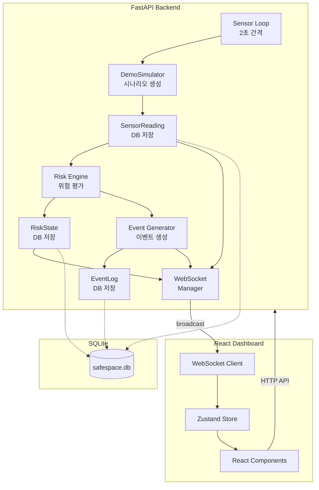
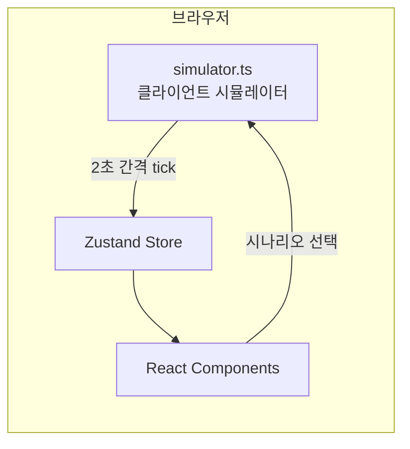
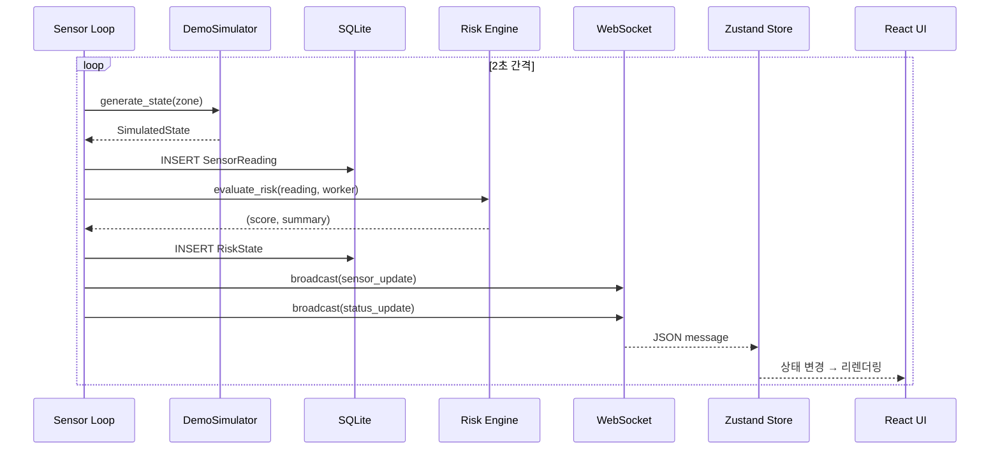
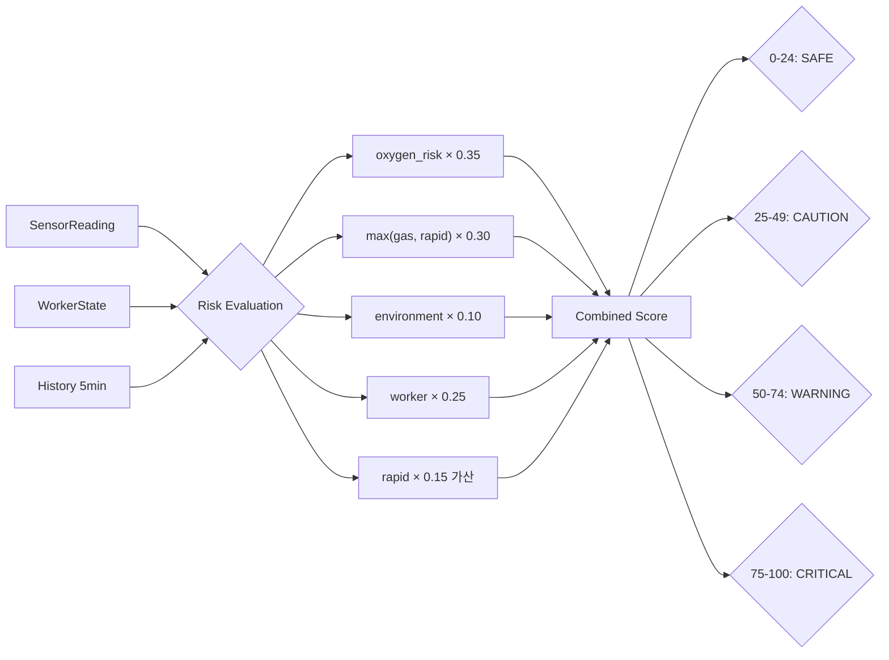

# 기술 설계

MVP는 **프론트엔드 중심**으로 설계한다. 백엔드는 데이터 공급과 위험 판단 로직 서버로 구성하되, GitHub Pages 정적 배포를 위한 클라이언트 사이드 시뮬레이터가 백엔드 로직을 완전히 대체할 수 있다.

---

## 기술 스택

### 프론트엔드

| 기술 | 버전 | 선정 근거 |
|------|------|-----------|
| **React** | 19.2 | 컴포넌트 기반 UI, 대규모 생태계, 실시간 데이터 렌더링에 적합 |
| **TypeScript** | 6.0 | 센서 데이터 스키마의 타입 안전성 보장, 리팩토링 안전성 |
| **Vite** | 8.0 | 빠른 HMR, ESM 기반 빌드, React 19 완벽 지원 |
| **Tailwind CSS** | 4.2 | `@theme` 기반 디자인 토큰, 유틸리티 우선 스타일링 |
| **Framer Motion** | 12.38 | 상태 전환 애니메이션, `AnimatePresence`로 조건부 렌더링 |
| **Recharts** | 3.8 | React 네이티브 차트, 실시간 시계열 데이터에 적합 |
| **Three.js** | 0.180 | 3D 렌더링 기반, Spark 2.0 peer dependency 호환 |
| **Spark 2.0** | 2.0 | Gaussian Splatting `.spz` 렌더링 (`SparkRenderer`, `SplatMesh`) |
| **Zustand** | 5.0 | 경량 전역 상태 관리, 보일러플레이트 최소화 |
| **React Query** | 5.99 | 서버 상태 캐싱, 자동 재시도, 백그라운드 갱신 |
| **React Router** | 7.14 | HashRouter로 GitHub Pages SPA 라우팅 |
| **Lucide React** | 1.8 | 일관된 아이콘 세트, 트리 셰이킹 지원 |

### 백엔드

| 기술 | 버전 | 선정 근거 |
|------|------|-----------|
| **FastAPI** | 0.115+ | 자동 OpenAPI 문서, async 지원, WebSocket 내장 |
| **SQLModel** | 0.0.22+ | SQLAlchemy + Pydantic 통합, 타입 안전 ORM |
| **Pydantic** | 2.0+ | 요청/응답 스키마 검증, FastAPI와 완벽 통합 |
| **SQLite** | 3 | 제로 설정, 파일 기반 DB, MVP에 적합한 경량성 |
| **uvicorn** | 0.30+ | ASGI 서버, WebSocket 지원, --reload 개발 모드 |
| **NumPy** | 1.26+ | 향후 시계열 분석 확장용 (현재 MVP에서는 미사용) |
| **Pandas** | 2.2+ | 향후 데이터 분석 확장용 (현재 MVP에서는 미사용) |

### 런타임 환경

| 항목 | 요구사항 |
|------|----------|
| Python | 3.10+ |
| Node.js | 18+ |
| 패키지 매니저 | pip (backend), npm (frontend) |

---

## 시스템 아키텍처

### Full-Stack 모드

백엔드 서버가 센서 데이터를 생성하고 WebSocket으로 프론트엔드에 전달하는 모드이다.

### Static 모드 (GitHub Pages)

백엔드 없이 클라이언트 사이드 시뮬레이터가 모든 데이터를 생성하는 모드이다.

!!! info "두 모드의 동등성"
    `simulator.ts`는 백엔드의 `DemoSimulator` + `risk/rules.py` 로직을 TypeScript로 완전히 포팅한 것이다. 동일한 임계치, 가중치, 상태 매핑을 사용하므로 두 모드의 동작이 일치한다.

---

## 데이터 흐름

### 센서 데이터 → UI 갱신 흐름

### 위험 평가 흐름

---

## 배포 아키텍처

| 환경 | 프론트엔드 | 백엔드 | 데이터 소스 |
|------|-----------|--------|------------|
| **GitHub Pages** | Vite 빌드 → 정적 파일 | 없음 | `simulator.ts` (클라이언트) |
| **로컬 개발** | Vite dev server (5173) | uvicorn (8000) | `DemoSimulator` (서버) |
| **프로덕션** | Nginx / CDN | uvicorn + Gunicorn | 실제 IoT 센서 (향후) |

### HashRouter 선택 이유

GitHub Pages는 SPA의 클라이언트 사이드 라우팅을 지원하지 않는다. `/demo` 같은 경로로 직접 접근하면 404가 발생한다. `HashRouter`는 `/#/demo` 형태의 URL을 사용하여 이 문제를 해결한다.

---

## 성능 고려사항

| 항목 | 전략 |
|------|------|
| **센서 히스토리** | Zustand 스토어에 최대 300개 유지 (MAX_HISTORY), 초과 시 FIFO |
| **이벤트 로그** | 최신 100건만 메모리 유지 |
| **리렌더링** | Zustand의 선택적 구독으로 필요한 컴포넌트만 갱신 |
| **차트 성능** | Recharts의 `isAnimationActive={false}` 옵션으로 대량 데이터 시 성능 확보 |
| **WebSocket** | ConnectionManager가 stale 연결 자동 정리 |

---

## 보안 고려사항

!!! warning "MVP 한계"
    현재 MVP는 공모전 시연 목적이므로 프로덕션 수준 보안은 적용하지 않았다.

| 항목 | 현재 상태 | 프로덕션 권장 |
|------|-----------|---------------|
| CORS | `allow_origins=["*"]` | 허용 도메인 제한 |
| 인증 | 없음 | JWT 또는 OAuth2 |
| HTTPS | GitHub Pages 자동 | Let's Encrypt / CloudFlare |
| 입력 검증 | Pydantic 스키마 | 추가 sanitization |
| Rate Limiting | 없음 | FastAPI middleware |
